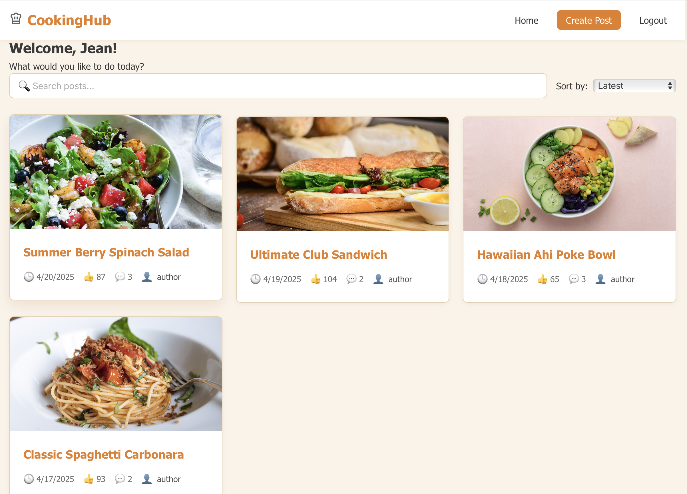

# CookingHub

A community-driven platform for cooking enthusiasts to share recipes, cooking tips, and culinary inspirations.

## About CookingHub

CookingHub is a web application designed for people who love cooking to connect, share, and discover culinary content. Users can create posts about their favorite recipes, cooking experiences, or food-related questions, and engage with other cooking enthusiasts through comments and upvotes.

## Features

### Core Functionality

- **User Authentication**
  - Register for a new account
  - Login to access personalized features
  - Logout to delete your account
- **Create Posts**: Share your culinary creations with the community
  - Add titles, descriptions, and images to showcase your dishes
- **Browse Feed**: Discover posts from fellow cooking enthusiasts
  - View post titles, creation times, and popularity
- **Sort & Search**: Find exactly what you're looking for
  - Sort posts by creation time or popularity
  - Search for specific recipes or cooking topics
- **Interact**: Engage with the community
  - View detailed information on individual post pages
  - Comment on posts to share your thoughts or ask questions
  - Upvote posts you find helpful or inspiring
- **Manage Content**: Full control over your contributions
  - Edit your previously created posts
  - Delete posts you no longer wish to share

### How to Use

1. **Authentication**:

   - Register a new account by clicking the "Sign Up" button and filling in your details
   - Login to your account with your credentials
   - Logout when you're finished using the application

2. **Home Feed**: When you first visit CookingHub, you'll see a feed of posts from the community.

   - Posts are displayed with their title, creation time, and upvote count
   - Use the sorting options to view posts by "Most Recent" or "Most Popular"
   - Use the search bar to find posts with specific titles

3. **Viewing Posts**: Click on any post title to see its detailed page.

   - The detailed view shows the full content and any attached images
   - Scroll down to see comments from other users
   - Use the upvote button to show appreciation for content you enjoy

4. **Creating Content**: Click the "Create Post" button to share your own content.

   - Fill in the required title field
   - Optionally add descriptive text about your recipe or cooking experience
   - Add an image URL to showcase your dish
   - Submit your post to share it with the community

5. **Managing Your Posts**: On your post's detailed page, you can:
   - Click "Edit" to update the post's title, content, or image
   - Click "Delete" to remove the post entirely

## Technologies Used

- React.js
- Vite
- CSS
- RESTful API architecture
- Express.js (for backend RESTful services)
- Node.js
- Fetch API for HTTP requests
- JavaScript Promises for asynchronous operations

### Media Credits

- Images: [Unsplash](https://unsplash.com) (Free to use under the [Unsplash License](https://unsplash.com/license))
- Fonts: [Google Fonts](https://fonts.google.com/) (Free to use under the [SIL Open Font License](https://scripts.sil.org/cms/scripts/page.php?site_id=nrsi&id=OFL))

### Libraries and Resources

- [React](https://reactjs.org/) - MIT License
- [Node.js](https://nodejs.org/) - MIT License
- [Express](https://expressjs.com/) - MIT License
- [Fetch API](https://developer.mozilla.org/en-US/docs/Web/API/Fetch_API) - Part of modern browsers' Web API
- JavaScript Promises - Standard JavaScript feature
